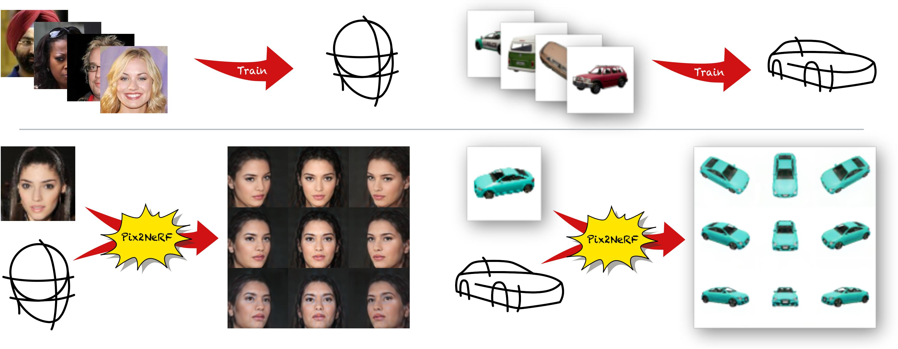

# Pix2NeRF: Unsupervised Conditional π-GAN for Single Image to Neural Radiance Fields Translation
[Video](https://www.youtube.com/watch?v=RoVu3hvvzGg) | [Paper](https://arxiv.org/abs/2202.13162)

To appear at [CVPR 2022](https://cvpr2022.thecvf.com/).

Code coming around CVPR 2022.



**Pix2NeRF: Unsupervised Conditional π-GAN for Single Image to Neural Radiance Fields Translation**<br>
[Shengqu Cai](https://primecai.github.io/), [Anton Obukhov](https://www.obukhov.ai/), [Dengxin Dai](https://vas.mpi-inf.mpg.de/dengxin/), [Luc Van Gool](https://ee.ethz.ch/the-department/faculty/professors/person-detail.OTAyMzM=.TGlzdC80MTEsMTA1ODA0MjU5.html)

Abstract: *We propose a pipeline to generate Neural Radiance Fields (NeRF) of an object or a scene of a specific class, conditioned on a single input image. This is a challenging task, as training NeRF requires multiple views of the same scene, coupled with corresponding poses, which are hard to obtain. Our method is based on π-GAN, a generative model for unconditional 3D-aware image synthesis, which maps random latent codes to radiance fields of a class of objects. We jointly optimize (1) the π-GAN objective to utilize its high-fidelity 3D-aware generation and (2) a carefully designed reconstruction objective. The latter includes an encoder coupled with π-GAN generator to form an auto-encoder. Unlike previous few-shot NeRF approaches, our pipeline is unsupervised, capable of being trained with independent images without 3D, multi-view, or pose supervision. Applications of our pipeline include 3d avatar generation, object-centric novel view synthesis with a single input image, and 3d-aware super-resolution, to name a few.*

## Citation

```
@inproceedings{cai2022pix2nerf,
  author = {Shengqu Cai and Anton Obukhov and Dengxin Dai and Luc Van Gool},
  title = {Pix2NeRF: Unsupervised Conditional $\pi$-GAN for Single Image to Neural Radiance Fields Translation},
  booktitle = {arXiv},
  year = {2022}
}
```
